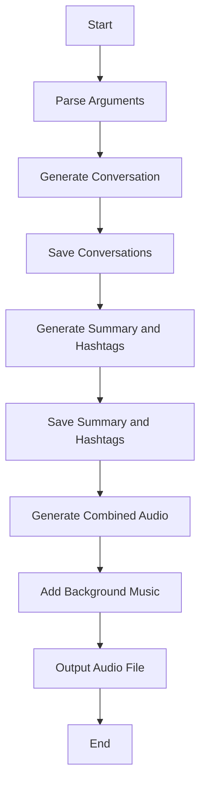
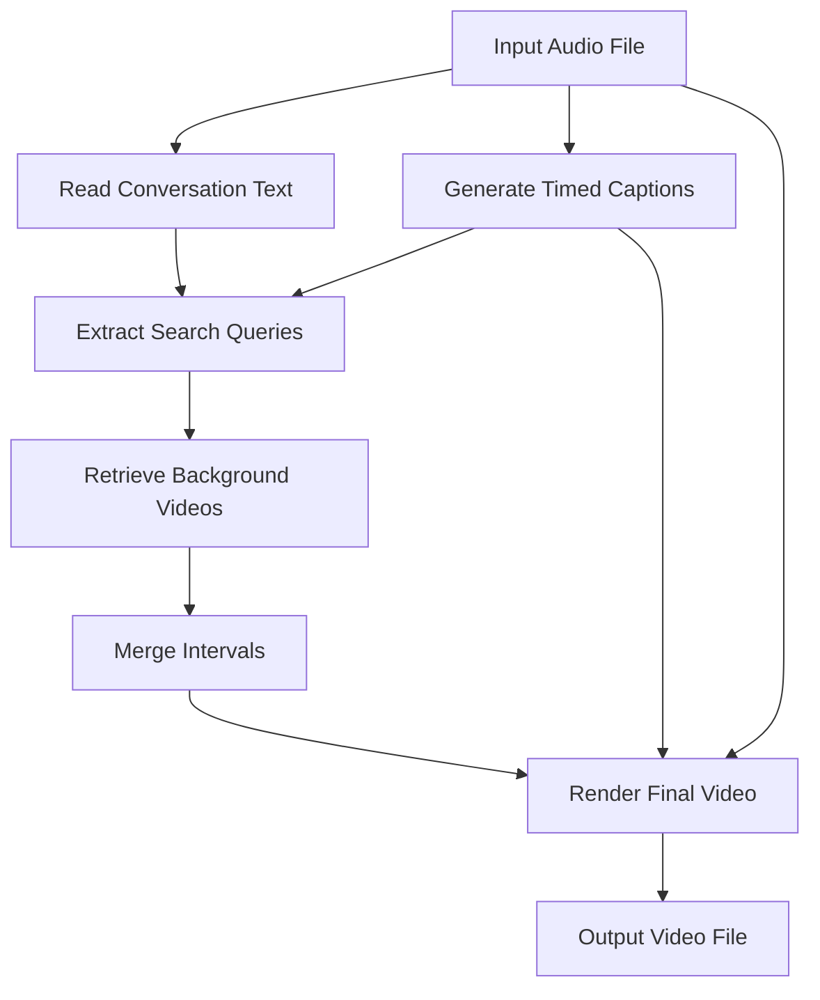

---

# Podcaster 🎙️


[](https://podcasters.spotify.com/pod/deon-blaauw6/episodes/)

---

## Contents

- [Podcast Generator](#podcast-generator)
  - [Features](#features)
  - [Installation](#installation)
  - [Usage](#usage)
  - [Command-Line Arguments](#command-line-arguments)
  - [Architecture](#architecture)
    - [Flow of Execution](#flow-of-execution)
    - [Components Overview](#components-overview)
  - [Functions Overview](#functions-overview)
  - [License](#license)
- [Pexel Video Generator](#pexel-video-generator)
  - [Features](#features-1)
  - [Installation](#installation-1)
  - [Usage](#usage-1)
  - [Command-Line Arguments](#command-line-arguments-1)
  - [Architecture](#architecture-1)
    - [Flow of Execution](#flow-of-execution-1)
    - [Components Overview](#components-overview-1)
  - [Functions Overview](#functions-overview-1)
  - [Experimental Note](#experimental-note)
  - [License](#license-1)

---

## Podcast Generator

This script generates a podcast episode featuring a conversation between two AI models—a host and a guest—based on a specified topic. It produces both text and audio outputs, along with a summary and relevant hashtags based on the generated dialogue.

### 🎯 Features

- **AI-Generated Conversation**: Simulates a dynamic conversation between a host and a guest AI on a given topic.
- **Text-to-Speech Support**: Converts the generated text into speech using OpenAI's TTS engine (default) or Microsoft Edge's TTS engine.
- **Audio Output with Background Music**: Creates an audio file with background music, complete with fade-in and fade-out effects.
- **Summary and Hashtags**: Generates a summary of the dialogue and relevant hashtags for social media promotion.
- **Customizable Output**: Adjust the duration, output directory, and TTS engine according to your preferences.

---

### 📥 Installation

1. **Clone the Repository**:

   ```bash
   git clone git@github.com:deonblaauw/podcaster.git
   cd podcaster
   ```

2. **Install Dependencies**:

   ```bash
   pip install -r requirements.txt
   ```

3. **Set Environment Variables**:

   The script requires API keys for OpenAI and Pexels.

   #### Setting Environment Variables on macOS

   Open your terminal and add the following lines to your `.zshrc` file:

   ```bash
   nano ~/.zshrc
   ```

   Add:

   ```bash
   export OPENAI_KEY='your_openai_api_key'
   export PEXELS_KEY='your_pexels_api_key'
   ```

   Save and exit (`Control + X`, then `Y`, then `Enter`), and then reload your shell:

   ```bash
   source ~/.zshrc
   ```

   **Note**: Replace `'your_openai_api_key'` and `'your_pexels_api_key'` with your actual API keys.

---

### 🎮 Usage

Run the script using the following command:

```bash
python gen_podcast.py "Your podcast topic" [options]
```

#### Example

```bash
python gen_podcast.py "The Future of Artificial Intelligence" --duration 30 --tts openai --output_dir my_podcast
```

---

### 🛠️ Command-Line Arguments

| Argument       | Type    | Default             | Description                                                                                                 |
|----------------|---------|---------------------|-------------------------------------------------------------------------------------------------------------|
| `topic`        | string  | *Required*          | The subject matter for the podcast.                                                                         |
| `--tts`        | string  | `openai`            | Choose the TTS engine (`openai` or `edge`).                                                                 |
| `--landscape`  | flag    | Portrait mode       | Optional flag to generate video in landscape mode (currently not implemented in `gen_podcast.py`).           |
| `--output_dir` | string  | `generated_outputs` | Specify the folder where text and audio files will be saved.                                                |
| `--duration`   | int     | `20`                | Approximate length of the podcast in minutes.                                                               |

---

### 🧩 Architecture

#### Flow of Execution

1. **Argument Parsing**: The script begins by parsing command-line arguments.
2. **Conversation Generation**:
   - Simulates a conversation by alternating responses between a host and a guest AI.
   - Uses random temperature settings for varied responses.
3. **File Saving**:
   - Saves the host and guest conversations to separate text files.
   - Saves the combined conversation to a `total_conversation.txt` file.
4. **Dialogue Summary**:
   - Generates a summary of the entire conversation.
   - Saves the summary and hashtags to a file.
5. **Audio Generation**:
   - Combines the host and guest conversations into a single audio file using the selected TTS engine.
6. **Adding Music**:
   - Adds background music with fade-in and fade-out effects to enhance the listening experience.

#### Components Overview

- **Script Generation**: Generates the conversation between host and guest AIs.
- **Audio Generation**: Converts text to speech and combines audio files.
- **Summary and Hashtags**: Generates a summary and relevant hashtags from the conversation.
- **Utility Functions**: Handles file operations and environment settings.

---

### 🗂️ Functions Overview

- **`generate_conversation`**:
  - Generates AI responses based on the previous turn's text.
  - Uses OpenAI's GPT models for text generation.

- **`summarize_dialog`**:
  - Summarizes the entire conversation for a quick overview.

- **`create_host_prompt` & `create_guest_prompt`**:
  - Templates for generating prompts for the host and guest AI.

- **`generate_combined_audio`**:
  - Combines the host and guest conversations into a single audio file.
  - Supports OpenAI TTS and Microsoft Edge TTS engines.

- **`add_music_with_tts`**:
  - Adds background music to the generated audio.
  - Handles fade-in and fade-out effects for a professional touch.

- **`generate_hashtags`**:
  - Generates trending hashtags from the conversation text using AI.

- **`save_episode_summary_to_file`**:
  - Saves the summary and hashtags to a specified file for easy access.

---

### 📊 Architecture Diagram



*Figure: Workflow of the Podcast Generator.*

---

### 📄 License

This project is licensed under the MIT License. See the [LICENSE](LICENSE) file for more information.

---

## Pexel Video Generator 🎥

---

### Experimental

This script is designed to generate a video based on a podcast episode, integrating timed captions and background footage sourced from Pexels. **Note**: This project is experimental and a work in progress, with ongoing improvements to enhance functionality and stability.

---

### 🎯 Features

- **Timed Captions**: Generates captions from the input audio and synchronizes them with the video.
- **Background Video Retrieval**: Searches and downloads relevant background videos from Pexels based on the conversation content.
- **Orientation Support**: Generates videos in both landscape and portrait modes.
- **Integration with Podcast Generator**: Uses outputs from `gen_podcast.py` to create a cohesive video experience.

---

### 📥 Installation

1. **Clone the Repository**:

   ```bash
   git clone <repository-url>
   cd <repository-directory>
   ```

2. **Install Dependencies**:

   ```bash
   pip install -r requirements.txt
   ```

3. **Install ffmpeg**:

   Ensure `ffmpeg` is installed on your system, as it's required for video processing.

4. **Set Environment Variables**:

   Similar to the Podcast Generator, set the `OPENAI_KEY` and `PEXELS_KEY` environment variables.

   #### Setting Environment Variables on macOS

   Open your terminal and add the following lines to your `.zshrc` file:

   ```bash
   nano ~/.zshrc
   ```

   Add:

   ```bash
   export OPENAI_KEY='your_openai_api_key'
   export PEXELS_KEY='your_pexels_api_key'
   ```

   Save and exit (`Control + X`, then `Y`, then `Enter`), and then reload your shell:

   ```bash
   source ~/.zshrc
   ```

---

### 🎮 Usage

Run the script using the following command:

```bash
python gen_pexel_video.py [options]
```

#### Example

```bash
python gen_pexel_video.py --input_file final_output.mp3 --output_dir my_video_output --landscape
```

---

### 🛠️ Command-Line Arguments

| Argument       | Type    | Default             | Description                                                                                               |
|----------------|---------|---------------------|-----------------------------------------------------------------------------------------------------------|
| `--landscape`  | flag    | Portrait mode       | Optional flag to generate video in landscape mode (default is portrait).                                  |
| `--output_dir` | string  | `generated_outputs` | Specify the folder where output files will be saved.                                                      |
| `--input_file` | string  | `final_output.mp3`  | Input audio file (e.g., the output from `gen_podcast.py`) that this script will use to generate the video.|

---

### 🧩 Architecture

#### Flow of Execution

1. **Argument Parsing**: The script begins by parsing command-line arguments.
2. **Reading Conversation Text**: Reads the conversation text from `total_conversation.txt` generated by `gen_podcast.py`.
3. **Generating Timed Captions**: Uses the input audio file to generate timed captions.
4. **Extracting Search Queries**: Generates search terms for video retrieval based on the conversation text and captions.
5. **Retrieving Background Videos**: Fetches background video URLs from Pexels using the generated search terms.
6. **Merging Intervals**: Merges empty intervals in the video URLs for smoother transitions.
7. **Video Rendering**: Combines the audio, captions, and background videos into the final output.

#### Components Overview

- **Timed Captions Generator**: Creates synchronized captions from the audio file.
- **Video Search Query Generator**: Extracts relevant keywords for video searches.
- **Background Video Generator**: Retrieves and downloads videos from Pexels.
- **Render Engine**: Compiles all media elements into a cohesive video.

---

### 🗂️ Functions Overview

- **`generate_timed_captions`**:
  - Generates captions with timing information from the input audio file.
  - Utilizes speech recognition to align text with audio.

- **`getVideoSearchQueriesTimed`**:
  - Analyzes the conversation text and captions to extract search queries.
  - Uses AI to determine the most relevant keywords.

- **`generate_video_url`**:
  - Fetches background video URLs from Pexels based on search terms.
  - Handles API interactions and error checking.

- **`merge_empty_intervals`**:
  - Merges intervals with no assigned videos to ensure continuous playback.
  - Optimizes the video timeline for better viewer experience.

- **`get_output_media`**:
  - Combines audio, video, and captions into the final video file.
  - Manages video effects, transitions, and rendering settings.

---

### 📊 Workflow Diagram



*Figure: Workflow of the Pexel Video Generator.*

---

### ⚠️ Experimental Note

This code is currently **experimental** and under active development. Features are subject to change, and there may be bugs or incomplete functionalities. Contributions and feedback are welcome to improve the project!

---

### 📄 License

This project is licensed under the MIT License. See the [LICENSE](LICENSE) file for more information.

---

# Additional Information

- **Developed and tested on macOS Sequoia 15.0.1**
- **Listen to our podcast on Spotify!**

  [](https://podcasters.spotify.com/pod/deon-blaauw6/episodes/)

---

# Feedback

- **User-Friendly**: The README is structured with clear sections and tables for easy navigation.
- **Comprehensive**: All provided information is retained and organized logically.
- **Visual Aids**: Added Mermaid diagrams to illustrate the architectures and workflows.
- **Clarity**: Improved descriptions and explanations for better understanding.
- **Ease of Use**: Step-by-step instructions make it straightforward to set up and run the scripts.

---

Let me know if there's anything else you'd like to add or modify!
